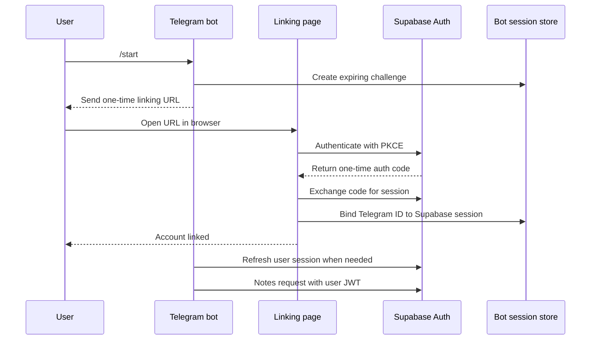

The next milestone is secure Telegram → Supabase account linking.

Before writing code, we need to approve the authentication architecture because it introduces credentials, persistent state, and a browser callback.

## Proposed authentication flow



Supabase’s PKCE authorization code is short-lived, single-use, and exchanged for an access/refresh-token pair. Telegram supports opaque `/start` parameters of up to 64 characters, although our initial link can be an ordinary HTTPS/localhost URL. [Supabase PKCE documentation](https://supabase.com/docs/guides/auth/sessions/pkce-flow), [Telegram deep-linking documentation](https://core.telegram.org/bots/features#deep-linking).

## Trust boundaries

| Identity or credential | Meaning                                           |
| ---------------------- | ------------------------------------------------- |
| Telegram user ID       | Identifies a Telegram account only                |
| Linking challenge      | Temporary permission to begin linking             |
| Supabase Auth code     | Temporary proof of successful authentication      |
| Supabase user ID       | Owner used by existing RLS policies               |
| Access token           | Short-lived authorization for Notes requests      |
| Refresh token          | Long-lived credential stored encrypted by the bot |
| Publishable key        | Public project identifier; not user authorization |

The bot must never turn this:

```text
telegram_user_id → notes.user_id
```

directly into authorization.

It must first establish:

```text
telegram_user_id
    → encrypted Supabase session
    → authenticated Supabase JWT
    → auth.uid()
    → existing Notes RLS
```

## Local-first implementation

For the local workshop:

- aiogram continues using long polling.
- A small HTTP callback server runs in the same process.
- It listens only on `127.0.0.1`.
- Linking is tested using Telegram Desktop and a browser on the same Mac.
- Bot-owned link and session state is stored in SQLite.
- Refresh tokens are encrypted before entering SQLite.
- No VPS, webhook, DNS, or public HTTPS is introduced yet.

For production later:

- the same callback routes move behind Caddy and HTTPS;
- the bot remains a single instance initially;
- SQLite receives a persistent Docker volume and backups;
- webhook deployment can be considered separately.

This avoids introducing FastAPI, Redis, another PostgreSQL role, or a shared package before we need them.

## Internal records

The bot needs two kinds of records.

### Linking challenge

```text
token_hash
telegram_user_id
telegram_chat_id
created_at
expires_at
consumed_at
```

Rules:

- generate the raw token with a cryptographically secure random generator;
- store only its SHA-256 hash;
- expire it after approximately 10 minutes;
- allow it to be consumed once;
- never log the raw token;
- restrict linking to private Telegram chats.

### Linked session

```text
telegram_user_id
supabase_user_id
encrypted_refresh_token
created_at
updated_at
```

Rules:

- unique Telegram user ID;
- unique Supabase user ID for the first version;
- refresh token encrypted with a separate environment key;
- refreshed tokens written back atomically;
- unlinking deletes the stored session;
- no access token needs permanent storage.

Supabase refresh tokens rotate and reuse outside the permitted interval can terminate the session. Therefore, refresh operations for one Telegram user must be serialized. [Supabase session documentation](https://supabase.com/docs/guides/auth/sessions).

## Implementation order

We should build this in small stages:

1. Add Supabase and linking configuration.
2. Add the SQLite schema and repository tests.
3. Add encrypted refresh-token storage.
4. Add one-time challenge creation and consumption.
5. Add the local browser callback server.
6. Add PKCE authentication.
7. Connect `/start` to the linking flow.
8. Add `/logout` and session-expiration behavior.
9. Add a two-user integration test.
10. Only then implement note creation and listing.

The immediate next coding step should be only **authentication configuration**—no database or browser server yet. It will introduce:

```text
SUPABASE_URL
SUPABASE_PUBLISHABLE_KEY
NOTES_BOT_BASE_URL
NOTES_BOT_ENCRYPTION_KEY
```

and validate that secret/service-role Supabase keys are rejected, following the same security behavior already used by Notes CLI.
